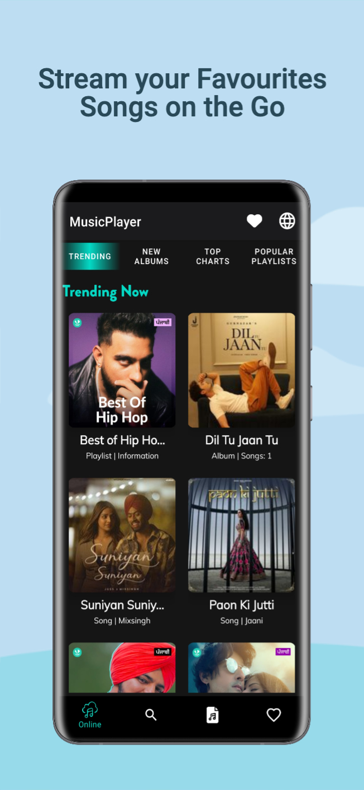
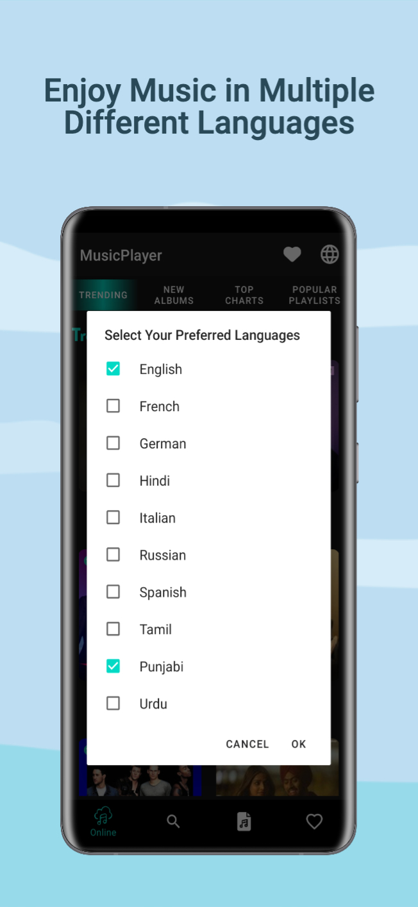
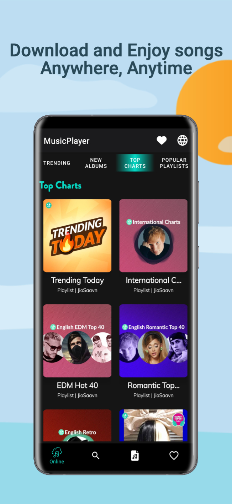
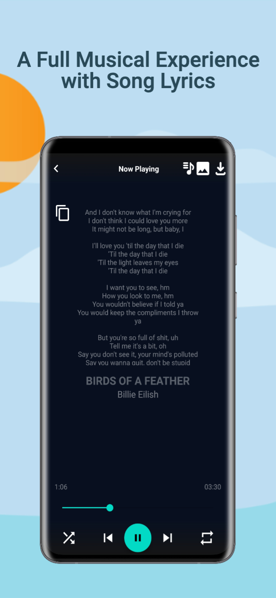

# MusicPlayer App 🎶

Welcome to the MusicPlayer app - your go-to solution for streaming, listening, and downloading music in five different languages! 🌍

  

## Features

- **Language Diversity:** Enjoy music in five different languages.
- **Stream and Listen:** Stream your favorite songs on the go with ease.
- **Download for Offline Listening:** Download songs to enjoy them offline anytime, anywhere.
- **Favorites:** Build your collection by adding songs to your favorites.
- **Lyrics:** View the lyrics of the songs being played for a complete musical experience.
- **Search Functionality:** Easily find songs, albums, artists, or playlists using keywords.

## Tech Stack

- **Language:** Java
- **API:** JioSaavan API

## Getting Started

To get started with the MusicPlayer app:

1. Clone this repository to your local machine.
2. Open the project in Android Studio.
3. Run the app on an emulator or a physical device.

## 📱 Screenshots

            

             

## Usage

- Browse and play your favorite songs.
- Download songs for offline listening.
- Add songs to your favorites.
- View and sing along with song lyrics.

## Contributing

Contributions are welcome! If you'd like to contribute, please follow these steps:

1. Fork this repository.
2. Create a new branch for your feature or bug fix.
3. Commit your changes and submit a pull request.

## Acknowledgments

Special thanks to the JioSaavan API for providing the music data that powers this app.

Feel the rhythm, enjoy the beats, and explore the world of music with the MusicPlayer app! 🎧🚀

#MusicPlayer #Java #AndroidApp #MusicStreaming #JioSaavanAPI
